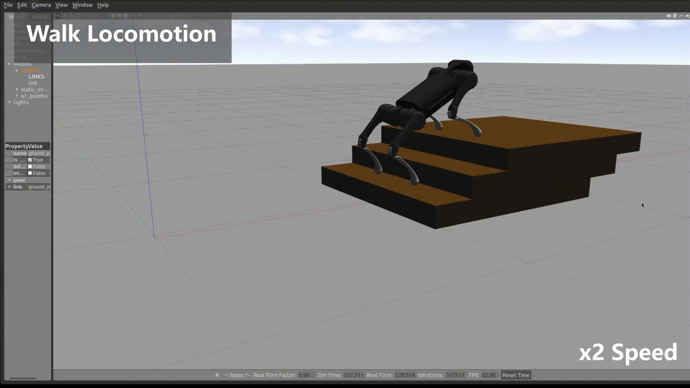

Overview
=========

This project provides an architecture and some key algorithms to control quadruped robots, including state estimator, gait generator, stance and swing leg controllers. 

The project now supports A1 robot (Unitree-Robotics) and Lite2A robot (Deep-Robotics). This project can be easily extended to support other quadruped robots such as AlienGO/GO1 (Unitree-Robotics), Jueying/X20(Deep-Robotics) and Anymal. For more information about quadruped robots, check out the following websites

* `Unitree Robotics <https://github.com/unitreerobotics>`_

* `Deep Robotics <https://www.deeprobotics.cn/>`_

* `AnyRobotics <https://www.anybotics.com/anymal-autonomous-legged-robot/>`_

.. image:: images/trot-mpc.gif
    :width: 600

.. image:: images/real.gif
    :width: 600

